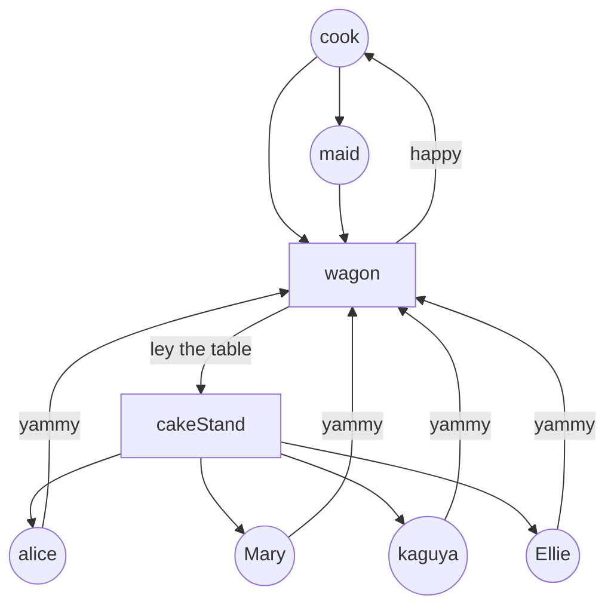

```mermaid
graph TD;
    A((cook)) --> B((maid));
    A --> C[wagon]
    B --> C;
    C -- ley the table --> E[cakeStand];
    E --> F((alice));
    E --> G((Mary))
    E --> H((kaguya))
    E --> I((Ellie))
    F -- yammy --> C 
    G -- yammy --> C 
    H -- yammy --> C 
    I -- yammy --> C 
    C -- happy--> A
```